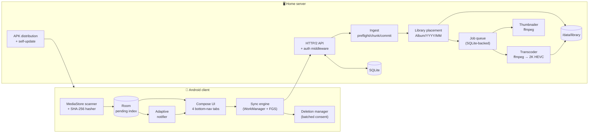

# Homesink — System Architecture

> Source of truth for implementation. Every work package in `04-`/`05-` is written so that it can
> be completed **without re-deriving any decision made here**. If an implementer needs a decision
> that is not written down, that is a bug in this document — fix the document first, then the code.

## 1. What the system is

Two programs and one contract between them:

| Part | Runs on | Stack | Artifact |
|---|---|---|---|
| **Client** | User's Android phone | Kotlin 2.0 + Jetpack Compose, minSdk 26, targetSdk 35 | `homesink-<ver>.apk`, sideloaded |
| **Server** | Always-on box in the home LAN (Linux Mint / Ubuntu) | Go 1.25, pure-Go SQLite, ffmpeg | OCI image, run as a rootless Podman quadlet |
| **Contract** | — | OpenAPI 3.1 (`docs/api/openapi.yaml`) | Frozen before either side is built |

The server is also the **distribution channel for the client**: it stores the APK and tells the app
when a newer one exists.

## 2. Architectural principles

These five principles are why the module boundaries fall where they do.

1. **Contract-first.** The HTTP API and both database schemas are frozen (WP-0, WP-B2, WP-C2)
   before feature work starts. Every other work package codes against a fixed contract and a fake,
   so client and server work can proceed in parallel and out of order.
2. **Content-addressed.** A file's SHA-256 is its identity everywhere: dedupe key, upload URL,
   resume key, thumbnail cache key. This makes uploads idempotent — retrying is always safe, and
   two phones uploading the same photo cost one transfer.
3. **Resumable and interruptible.** Phone sync dies constantly (screen off, WiFi drop, Doze). Every
   long operation persists its progress to disk and can be re-entered from where it stopped. No
   operation holds state only in memory.
4. **Atomic on disk.** Nothing appears in the browsable library until it is complete and verified.
   All writes are write-to-temp-then-`rename(2)` within a single filesystem.
5. **The library is human-browsable.** `Album/Year/Month/file.jpg` on the drive is a first-class
   output, not an implementation detail. Someone plugging the drive into a laptop must find their
   photos without Homesink.

## 3. System overview



## 4. Repository layout

```
homesink/
├── docs/                       # this architecture (read 00 → 08 in order)
│   └── api/openapi.yaml        # THE contract — both sides generate/validate against it
├── backend/
│   ├── cmd/homesinkd/          # main(): wiring only, no logic
│   ├── internal/
│   │   ├── core/               # FROZEN after WP-B1: domain types + interfaces, zero deps
│   │   ├── config/  store/     # env config; SQLite access layer
│   │   ├── httpapi/            # routing, middleware, handlers (one file per resource)
│   │   ├── auth/    ingest/    # pairing + tokens; preflight/chunks/commit
│   │   ├── library/ jobs/      # path placement; persistent queue + worker pool
│   │   ├── media/              # ffmpeg wrappers: probe, thumbnail, transcode
│   │   ├── appdist/ selfupdate/ discovery/
│   │   └── testutil/           # fakes + golden fixtures shared by all packages
│   ├── migrations/             # 0001_init.sql, … (embedded via go:embed)
│   └── deploy/                 # Containerfile, quadlet units, compose, install.sh
└── client/
    └── app/src/main/java/de/homesink/app/
        ├── contract/           # FROZEN after WP-C1: interfaces + DTOs, no Android imports
        ├── data/{db,net,repo}/ media/  sync/  notify/  update/
        ├── ui/{theme,nav,sync,queue,browse,settings,pairing}/
        └── di/                 # Hilt modules, one per feature package
```

### 4.1 Why one Gradle module and one Go module

A multi-module Gradle build enforces boundaries at the cost of build-file wiring that is a
disproportionate source of failure for automated implementers (KSP/Hilt config, version catalogs,
`api` vs `implementation` leaks). Boundaries are instead enforced by:

- a **`contract` / `core` package that is frozen** after the foundation work package and that later
  work packages may *read* but never *edit*;
- Kotlin `internal` visibility and Go's `internal/` + unexported symbols;
- **one Hilt module / one constructor-injection site per feature package**, so two work packages
  never edit the same DI file.

The cost is that a violation is a review finding rather than a compile error. That trade is worth it
here. See `08-ROADMAP.md §4` for the file-ownership table that keeps parallel work conflict-free.

## 5. Storage layout on the sink drive

Everything lives under one mount point (`$HOMESINK_DATA`) so that `rename(2)` is atomic.

```
$HOMESINK_DATA/
├── library/                                  ← the human-browsable output
│   └── <Album>/<YYYY>/<MM>/<filename.ext>
└── .homesink/                                ← machine-owned, safe to delete except db/
    ├── db/homesink.db{,-wal,-shm}            ← SQLite, WAL mode
    ├── staging/<sha256>.part                 ← in-flight uploads
    ├── thumbs/<ab>/<sha256>_<256|1024>.webp  ← content-addressed, immutable
    ├── work/<jobid>.tmp.<ext>                ← transcoder scratch
    ├── apk/homesink-<versionName>-<code>.apk + latest.json
    └── backups/homesink-<date>.db            ← nightly VACUUM INTO, keep 7
```

**Never** put anything in `library/` that is not a user media file — no sidecars, no `.thumbs`, no
index files. The requirement is that the tree is browsable by a human, and stray files break that.

## 6. Security model

The requirements never mention authentication. "Trusted local network" is not a security model on
its own: the APK is distributed openly, and the server holds every photo the household owns. The
minimum that does not compromise usability:

| Concern | Decision |
|---|---|
| Server identity | Self-signed TLS cert generated on first run; its SPKI SHA-256 fingerprint is handed to the client during pairing and **pinned**. No "trust all certs". |
| Device enrolment | 6-digit pairing code, 10-minute TTL, single use, rate-limited to 5 attempts. Shown by `homesinkd pair` and on `http://<host>:<port>/pair` (LAN-only bind). |
| Device credential | 32 random bytes → `hs_<base64url>`. Stored **hashed (Argon2id)** server-side, in `EncryptedSharedPreferences` client-side. Sent as `Authorization: Bearer`. |
| Revocation | `GET/DELETE /v1/devices` — a lost phone can be cut off without re-pairing the others. |
| Exposure | Binds to `0.0.0.0` but the deploy docs are explicit: **do not port-forward**. Remote access is a WireGuard/Tailscale concern, out of scope. |
| Logs | Never log tokens, pairing codes, or full file paths of user media at INFO. Hashes are truncated to 12 chars in logs. |

Full reasoning and the alternatives considered: `01-DECISIONS.md` D-01 … D-04.

## 7. What this architecture deliberately does not do

Out of scope, and the modules assume they never happen — adding them later is a schema change:
multi-user accounts and per-user isolation; sync **from** server to phone (this is one-directional
ingest); editing or deleting library files from the app; iOS; internet-facing access; face/object
recognition; sharing links.

## 8. Reading order

| # | Document | Read it when |
|---|---|---|
| 00 | This file | Always first |
| 01 | `01-DECISIONS.md` | Before any implementation — resolves everything the requirements left open |
| 02 | `02-API.md` + `api/openapi.yaml` | Any work touching the wire |
| 03 | `03-DATA-MODEL.md` | Any work touching persistence |
| 04 | `04-WORKPACKAGES-BACKEND.md` | Implementing a `WP-B*` |
| 05 | `05-WORKPACKAGES-CLIENT.md` | Implementing a `WP-C*` |
| 06 | `06-ALGORITHMS.md` | Implementing scheduling, selection defaults, or the media pipeline |
| 07 | `07-DEPLOYMENT.md` | Packaging, install, self-update |
| 08 | `08-ROADMAP.md` | Sequencing and parallelising the work |
