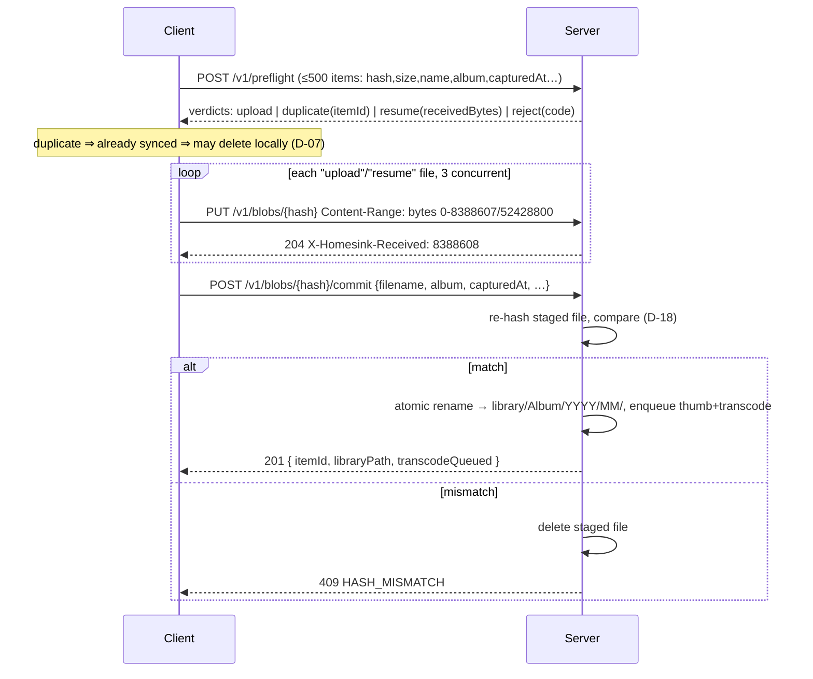

# Homesink — HTTP API

Machine-readable: [`api/openapi.yaml`](api/openapi.yaml). That file is **normative**; this one explains
the flows. Both sides validate against it in CI (`WP-0`).

- Base path `/v1`, HTTP/2 over TLS (D-02). JSON request/response bodies are UTF-8 and gzip-negotiated;
  media bodies are raw `application/octet-stream` and never compressed.
- `camelCase` fields. Timestamps are epoch **milliseconds** (`Int64`) — never strings, never seconds.
- Auth: `Authorization: Bearer hs_…` on everything except `/healthz`, `/v1/pair`, `/v1/app/latest`,
  `/v1/app/download`.

## 1. Standard headers

| Header | Direction | Meaning |
|---|---|---|
| `X-Homesink-Client: <code>/<name>` | → | App version on **every** request (D-33) |
| `X-Homesink-Latest: <code>;<name>;<sha256>;<url>` | ← | Present on any response when an update exists |
| `X-Homesink-Time: <RFC3339>` | ← | Server clock, for skew detection (D-04) |
| `X-Homesink-Received: <bytes>` | ← | Bytes the server holds for this blob |
| `X-Request-Id: <uuid>` | ↔ | Echoed; appears in server logs for support |

## 2. Errors — one shape, always

```json
{ "error": { "code": "HASH_MISMATCH", "message": "…human, German-safe…", "retryable": false,
             "details": { "expected": "a1b2…", "actual": "ff00…" } } }
```

| Code | HTTP | Retryable | Client action |
|---|---|---|---|
| `UNAUTHORIZED` | 401 | no | Drop token, re-pair (`sync_problem` notification) |
| `PAIRING_CODE_INVALID` / `_EXPIRED` | 400 / 410 | no | Show error, ask for a new code |
| `PAIRING_RATE_LIMITED` | 429 | after `retryAfterMs` | Lock the field, count down |
| `RANGE_MISMATCH` | 409 | yes | `HEAD` the blob, resume from `X-Homesink-Received` |
| `HASH_MISMATCH` | 409 | once | Re-hash locally once, retry, then fail the file (D-18) |
| `UNSUPPORTED_MEDIA_TYPE` | 415 | no | Mark skipped, never re-offer |
| `FILE_TOO_LARGE` | 413 | no | Mark skipped, explain in the queue screen |
| `INSUFFICIENT_STORAGE` | 507 | no | Abort the run, `sync_problem` notification |
| `NOT_FOUND` | 404 | no | Refresh the list |
| `INTERNAL` | 500 | yes | Backoff (D-19) |

## 3. Pairing

```
POST /v1/pair            { "code":"483920", "deviceName":"Pixel 8", "platform":"android",
                           "appVersionCode":14 }
  201 → { "token":"hs_…", "deviceId":"dev_…", "serverId":"srv_…",
          "serverName":"Wohnzimmer-NAS", "tlsSpkiSha256":"base64…", "serverTimeMs":… }
GET    /v1/devices        → [ { deviceId, name, lastSeenMs, appVersionCode, current } ]
DELETE /v1/devices/{id}   → 204     # revoking your own device is allowed and logs you out
```
The code is generated by `homesinkd pair` (prints it, 10 min TTL) or shown at
`http://<host>:<port>/pair`. See D-01.

## 4. The sync flow



### 4.1 `POST /v1/preflight`
```json
{ "items": [ { "clientId":"c_8831", "hash":"a1b2…64hex", "sizeBytes":52428800,
               "filename":"VID_20250817_143201.mp4", "mimeType":"video/mp4",
               "album":"Camera", "capturedAtEpochMs":1755434921000,
               "capturedAtOffsetMin":120, "mediaType":"video",
               "width":3840, "height":2160, "durationMs":42000 } ] }
```
```json
{ "results": [ { "clientId":"c_8831", "verdict":"resume", "receivedBytes":16777216 } ],
  "serverTimeMs": 1755434930000 }
```
`verdict` ∈ `upload` | `duplicate` | `resume` | `reject`. `duplicate` carries `itemId` and
`libraryPath`; `reject` carries `code`. Max 500 items; 400 `BATCH_TOO_LARGE` beyond that.
Whole-batch 507 if the disk guard trips (D-20).

### 4.2 Blob transfer
```
HEAD /v1/blobs/{hash}              → 204 X-Homesink-Received: <n>   | 404 if unknown
PUT  /v1/blobs/{hash}              Content-Range: bytes <s>-<e>/<total>
                                   → 204 X-Homesink-Received  | 409 RANGE_MISMATCH (+ header)
POST /v1/blobs/{hash}/commit       { clientId, filename, album, mimeType,
                                     capturedAtEpochMs, capturedAtOffsetMin, mediaType,
                                     width?, height?, durationMs? }
                                   → 201 { itemId, libraryPath, deduplicated, transcodeQueued }
                                   → 409 HASH_MISMATCH   (staged file destroyed)
DELETE /v1/blobs/{hash}            → 204   abort, drop staged bytes
```
Chunks must be sequential and start at `X-Homesink-Received`; out-of-order → `RANGE_MISMATCH` with
the correct offset, so the client self-heals in one round trip.

## 5. Browsing

```
GET /v1/library/albums
    → [ { album, itemCount, sizeBytes, latestCapturedAtMs, coverHash } ]
GET /v1/library/albums/{album}/periods
    → [ { year, month, itemCount, sizeBytes } ]
GET /v1/library/items?album=&year=&month=&cursor=&limit=100
    → { items:[ { itemId, hash, filename, album, year, month, mediaType, mimeType,
                  sizeBytes, width, height, durationMs, capturedAtMs, hasTranscode } ],
        nextCursor: "…"|null }
GET /v1/thumbs/{hash}?s=256|1024      → image/webp, immutable, ETag, 1-year cache
GET /v1/media/{itemId}[?variant=original|optimized]
    → the file, Range-capable (206), Content-Type from the item
```
Pagination is **keyset** on `(capturedAtMs DESC, itemId DESC)` — never `OFFSET` (see §11 of
`01-DECISIONS.md`). `album` is URL-path-escaped; the server never resolves `..`.

## 6. App distribution & system

```
GET /v1/app/latest      → { versionCode, versionName, sha256, sizeBytes, minSdk,
                            releaseNotes, downloadUrl }        # unauthenticated
GET /v1/app/download    → the APK, Range-capable                # unauthenticated
GET /v1/system/status   → { serverVersion, uptimeSec, itemCount, blobCount,
                            libraryBytes, freeBytes, jobsQueued, jobsFailed }
GET /v1/system/update   → { current, latestAvailable, lastCheckMs, lastResult }
GET /healthz            → 200 "ok"    # the health gate podman rolls back on (D-35)
```
The APK endpoints are unauthenticated **by design**: a user who has just installed the app has no
token yet, and the APK is verified by SHA-256 + signing key rather than by transport auth (D-34).

## 7. Rules that keep the contract honest

1. **Additive changes only.** New optional fields are fine; renaming or removing one is a new path.
2. **Unknown fields are ignored** by both sides — an old app must not break against a new server.
3. **Every endpoint is idempotent or explicitly not**, and it says which in the OpenAPI `description`.
4. **Fixtures are the tests.** `backend/internal/testutil/testdata/*.json` holds one request and one
   response example per endpoint; the client's MockWebServer replays the same files. A change to a
   fixture that is not mirrored on both sides fails CI.
