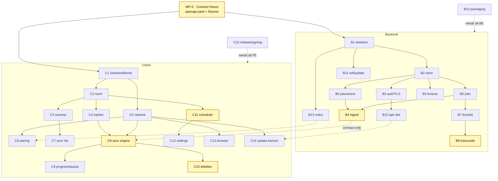

# Homesink — Build Order

## 1. Dependency graph



Highlighted nodes are the **critical/risky** ones (Tier L or blocking everything): `WP-0`, `B4`, `B8`,
`C8`, `C10`, `C11`. Everything else is routine.

The dotted client→server edges are **contract dependencies only** — `C8` can be built and fully tested
against the fixtures from `WP-0` before `B4` exists. That is the entire reason the contract is frozen first.

## 2. Milestones

| # | Milestone | Contains | Demonstrates |
|---|---|---|---|
| **M0** | Contract | WP-0 | `openapi.yaml` validates; fixtures exist for every endpoint; both CI jobs run against them |
| **M1** | Walking skeleton | B1, B2, B3, C1, C2, C5, C6 | Phone pairs with the server over pinned TLS. Nothing syncs yet — but the riskiest integration (auth + TLS + discovery) is proven first |
| **M2** | Ingest works | B4, B5, B6, C3, C4, C7, C8 | Photos land in `Album/YYYY/MM/` on the drive, dedupe and resume both provably work |
| **M3** | Complete sync UX | B7, B9, C9, C10, C13 | Progress notification, queue screen, batched deletion consent, browsing the sink |
| **M4** | Unattended operation | B8, C11, C12 | Videos transcode in the background; the app asks at a learned time and stops annoying the user |
| **M5** | Shippable | B10, B11, B12, B13, B14, C14, C15 | Signed APK served by the server, in-app updates, self-updating container with rollback |

M1 deliberately front-loads pairing/TLS/mDNS: it is the integration most likely to produce a surprise,
and discovering it at M4 would invalidate work in between.

## 3. Parallelisation

After M0, two tracks run independently. Within a track, these sets have no shared files and can be
worked simultaneously:

```
Backend wave 1:  B1 → then {B2}  → then {B3, B5, B6, B9, B11, B13} in parallel
Backend wave 2:  {B4, B7} → {B8} → {B10} → {B12, B14}
Client  wave 1:  C1 → then {C2, C5} → then {C3, C4, C6, C13, C14} in parallel
Client  wave 2:  {C7, C8} → {C9, C10} · {C11 → C12} runs parallel to all of wave 2
```

Assign Tier L packages (`B4`, `B8`, `C8`, `C10`, `C11`) to a stronger model or review them closely.
Tier S packages are safe to hand out in parallel with minimal supervision.

## 4. File ownership — no two packages write the same file

This table is what makes parallel work safe. If an assignment seems to require editing a file it does not
own, that is a design problem: raise it, do not edit the file.

| File / directory | Owner | Others may |
|---|---|---|
| `docs/api/openapi.yaml` | WP-0 | read only — a change is a contract change and re-runs both CI suites |
| `internal/core/**` | WP-B1 | read only (frozen) |
| `contract/**` (Kotlin) | WP-C1 | read only (frozen) |
| `internal/store/**`, `migrations/**` | WP-B2 | call `core.Store`; a new method is a WP-B2 change request |
| `internal/httpapi/server.go`, `middleware.go` | WP-B1 | register routes from `handlers_*.go`, never edit the router file |
| `internal/httpapi/handlers_<x>.go` | the WP owning `<x>` | — |
| `internal/media/ffmpeg.go` | WP-B7 | WP-B8 calls it, does not modify it |
| `res/values/strings.xml` | shared, **append-only** | add keys at the end; never reword or delete another package's key |
| `di/<Feature>Module.kt` | the WP owning that feature | one module per feature package, so DI never collides |
| `MainActivity.kt`, `ui/nav/**` | WP-C1 | add a destination via the `Destinations` enum only |
| `build.gradle.kts` | WP-C1 | dependency additions go through WP-C1 to keep the version catalog coherent |

## 5. Test strategy

| Level | Backend | Client |
|---|---|---|
| Unit | Every pure function: `SanitizeAlbum`, `BuildRelPath`, skip-decision, `ScheduleLearner` | Same — `ScheduleLearner` and the default-mode rules are pure and must be tested without Android |
| Contract | Handlers replay `testdata/*.json` | MockWebServer replays **the same files** |
| Integration | `httptest` + temp dir + real SQLite: full preflight→upload→commit→browse | Room in-memory + MockWebServer: full sync run |
| Instrumented | — | MediaStore scan, deletion consent, notification posting (these cannot be unit-tested honestly) |
| E2E | One script: real server in a container + `adb`-driven APK, 20 files incl. one duplicate, one >30 MB video, one deliberately corrupted upload |

**The shared fixture directory is the load-bearing part.** `backend/internal/testutil/testdata/` is
copied into `client/app/src/test/resources/fixtures/` by a Gradle task. Both suites deserialise the same
bytes, so a field renamed on one side fails the other side's build — which is the only cheap way to keep
two languages honest about one contract.

## 6. Risk register

| Risk | Impact | Mitigation |
|---|---|---|
| **Deletion consent UX** (D-22) | Users cannot free space — the app's main promise | Prototype `C10` during M1 on a real device before committing to the M3 design. Highest-uncertainty item in the project |
| **Transcode destroys the only copy** (D-30) | Permanent data loss | Four verification gates; full-decode gate is non-negotiable; `HOMESINK_KEEP_ORIGINAL_VIDEOS` escape hatch |
| **Background execution limits** | Sync never runs on aggressive OEMs (Xiaomi, Samsung) | Sync is user-initiated from a notification, not silent background work — this design sidesteps most of it. Document the battery-optimisation exemption prompt |
| **`blobs.hash` rewritten after transcode** (D-08) | Every video re-uploads forever; silent and expensive | Named regression test in `WP-B8` acceptance |
| **Auto-update ships a broken image** | Server down until someone notices | `Notify=healthy` + podman rollback; `/healthz` must be able to fail |
| **Keystore loss** (D-34) | Every user must uninstall/reinstall | CI secret + offline backup, called out in `client/README.md` |
| **mDNS blocked on the LAN** | Onboarding dead-ends | Manual host entry is always available, never behind an "advanced" toggle |

## 7. First three commands

```bash
git init
```
Then WP-0: write `docs/api/openapi.yaml` fixtures, wire both CI jobs to validate against them, and only
then start B1 and C1 in parallel.
